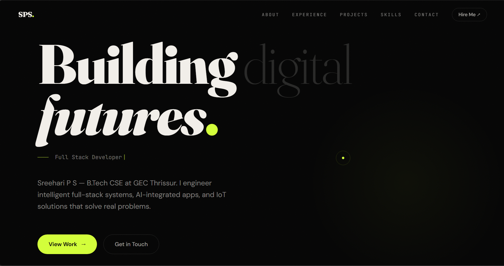

# Sreehari P S — Developer Portfolio




> A highly optimized, single-page developer portfolio designed to showcase projects, technical experience, and engineering capabilities.

[](https://react.dev/)
[](https://www.typescriptlang.org/)
[](https://tailwindcss.com/)
[](https://vitejs.dev/)

## ⚡ Engineering Highlights

While many portfolios are simple HTML dumps, this repository was engineered with performance and modern best practices in mind:
* **Zero-Jank Scroll Animations:** Progress bars and reveals use `useRef` direct DOM manipulation and `IntersectionObserver` instead of triggering expensive React state re-renders on scroll.
* **Modern Tooling:** Built on the bleeding edge with **React 19** and **Tailwind CSS v4** for lightning-fast compilation and minimal bundle size.
* **A11y & SEO Optimized:** Semantic HTML, bypass links for screen readers, and fully configured metadata for search engine indexing.
* **Custom Cursor Engine:** Highly optimized requestAnimationFrame loop for custom mouse interactions without frame drops.

## 🚀 Running Locally

To run this project on your local machine, ensure you have Node.js (v20+) and `pnpm` installed.

1. **Clone the repository:**
   ```bash
   git clone https://github.com/Sreehari-P-S-10/Portfolio.git
   cd Portfolio
   ```

2. **Install dependencies:**
   ```bash
   pnpm install
   ```

3. **Start the dev server:**
   ```bash
   pnpm run dev
   ```

## 📬 Let's Connect
* **Email:** [pssreehari10@gmail.com](mailto:pssreehari10@gmail.com)
* **LinkedIn:** [sreehari-p-s-](https://linkedin.com/in/sreehari-p-s-)

---
*Crafted with intent. © 2026 Sreehari P S.*
